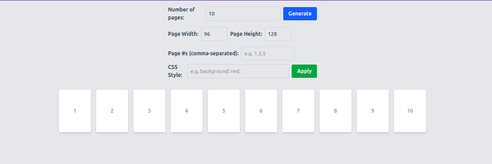
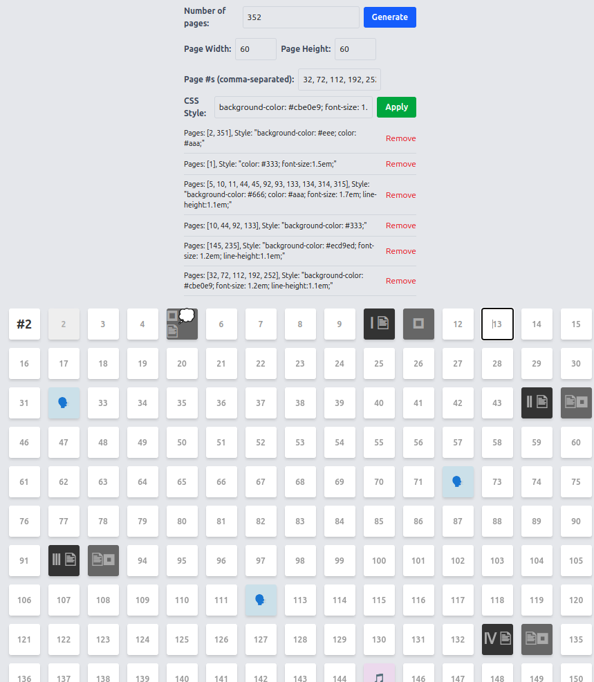

# Book Layout overview

This is a simple, fluid book-layout web application that dynamically displays a specified number of pages.

## Features

- **Fluid Layout**: Pages wrap automatically to fit the available space.
- **Editable Pages**: Each page’s content is `contentEditable` (click on it).
- **LocalStorage Persistence**: Page settings (dimensions, text, styles, etc.) are saved across sessions.
- **Custom CSS for Specific Pages**: Apply multiple CSS styles to individual or multiple pages (comma-separated) and remove them later.

## Usage
1. Enter the number of pages and click **Generate**.
2. Adjust **Page Width** and **Page Height** as desired.
3. Specify the pages to style in **Page #s** and enter the **CSS Style** (e.g., `background: red;`), then click **Apply**.
4. **Remove** applied styles from the list below if needed.

